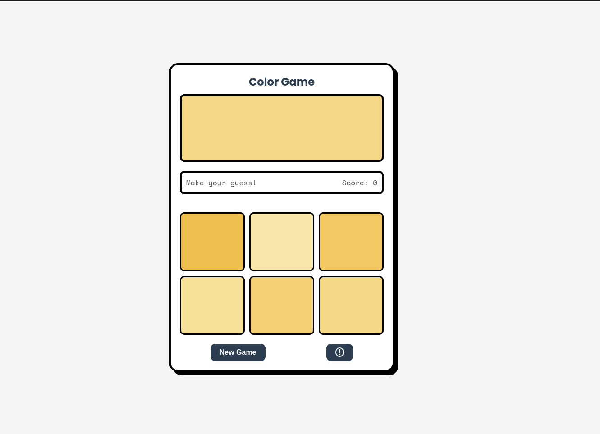

### README.md

```markdown
# Color Guessing Game

A fun and interactive color guessing game designed in the **Neobrutalism style**. The game challenges players to match the target color from a set of options, with dynamic feedback and animations.



---

## Features

- **Neobrutalism Design**: Bold borders, solid colors, and box-shadow effects.
- **Interactive Gameplay**: Guess the correct color from six options.
- **Dynamic Feedback**: Toast notifications with GIFs for correct and wrong guesses.
- **Score Tracking**: Keep track of your correct guesses.
- **Instructions Modal**: Learn how to play with a slide-up modal.
- **Responsive Design**: Works seamlessly on desktop, tablet, and mobile devices.

---

## How to Play

1. A **target color** is displayed at the top of the screen.
2. Six **color options** are provided below.
3. Click on the color option that matches the target color.
4. If your guess is correct:
   - Your score increases.
   - A toast notification with a **Happy Earth GIF** appears.
5. If your guess is wrong:
   - The incorrect option is disabled.
   - A toast notification with a **Headache GIF** appears.
6. Click the **New Game** button to start over.

---

## Technologies Used

- **HTML**: Structure of the game.
- **CSS**: Styling and animations.
- **JavaScript**: Game logic and interactivity.
- **FontAwesome**: Icons for the instructions button.
- **Google Fonts**: Typography (Space Mono and Poppins).

---

## Setup Instructions

1. **Clone the Repository**:
   ```bash
   git clone https://github.com/Peliah/color-guessing-game.git
   cd color-guessing-game
   ```

2. **Open the Project**:
   - Open the `index.html` file in your browser.

3. **Customize**:
   - Update the `index.html` file to change the game title or instructions.
   - Modify the `styles.css` file to adjust the design and colors.
   - Edit the `script.js` file to add or modify functionality.

---

## File Structure

```
color-guessing-game/
├── index.html          # Main HTML file
├── styles.css          # CSS styles for the game
├── script.js           # JavaScript for game logic
├── assets/             # Folder for GIFs and other assets
│   ├── Happy Earth.gif # GIF for correct guesses
│   └── Headache.gif    # GIF for wrong guesses
│   └── preview.png     # Screenshot of the game
└── README.md           # Project documentation
```

---

## Design and Animations

- **Neobrutalism Style**:
  - Bold borders and solid colors.
  - Box-shadow effects for depth.
- **Toast Notifications**:
  - Slide-up animations with GIFs for feedback.
- **Modal**:
  - Slide-up animation for the instructions modal.
- **Hover Effects**:
  - Buttons and color options have hover effects for interactivity.

---

## Credits

- **Design & Development**: [Peliah](https://github.com/Peliah)
- **Fonts**: [Google Fonts](https://fonts.google.com/)
- **Icons**: [FontAwesome](https://fontawesome.com/)
- **GIFs**: [StorySet](https://storyset.com/)

---

## License

This project is licensed under the MIT License. See the [LICENSE](LICENSE) file for details.

---

## How to Contribute

1. Fork the repository.
2. Create a new branch (`git checkout -b feature/YourFeatureName`).
3. Commit your changes (`git commit -m 'Add some feature'`).
4. Push to the branch (`git push origin feature/YourFeatureName`).
5. Open a pull request.

---

Enjoy the game! 🎨 🚀
```